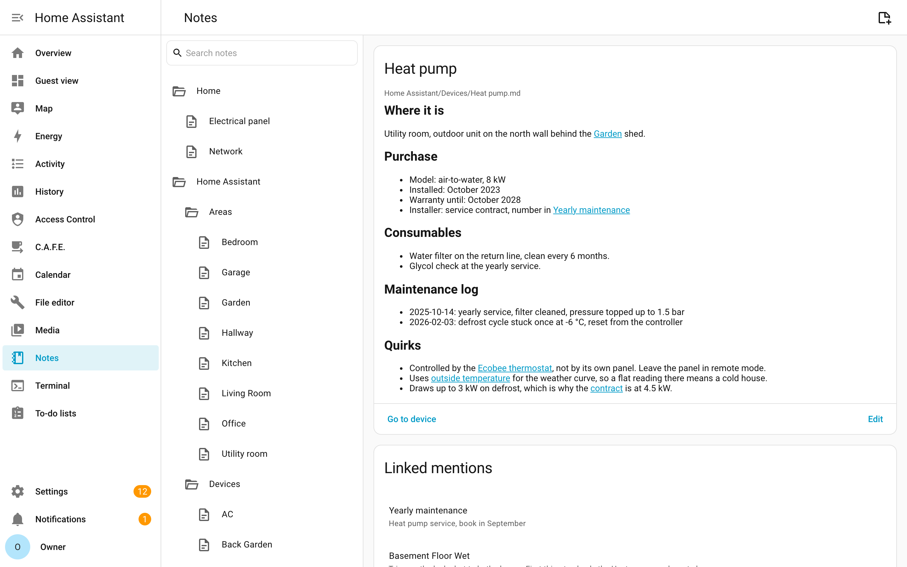
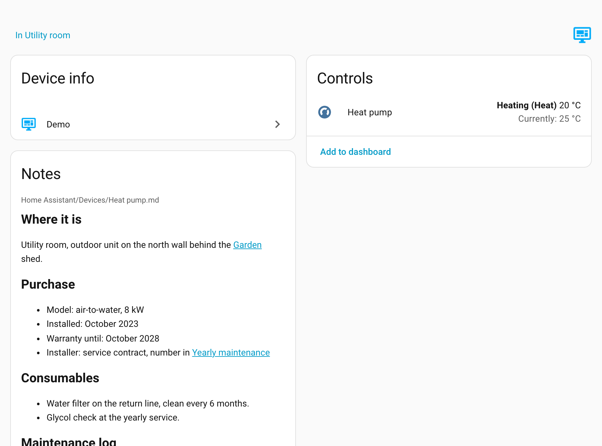
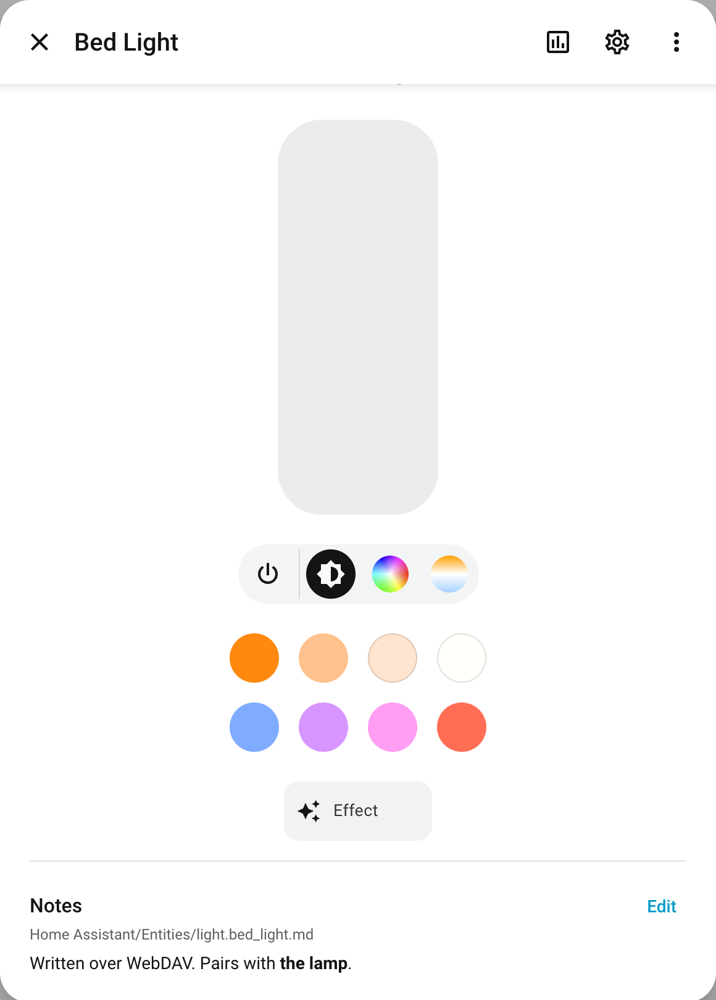
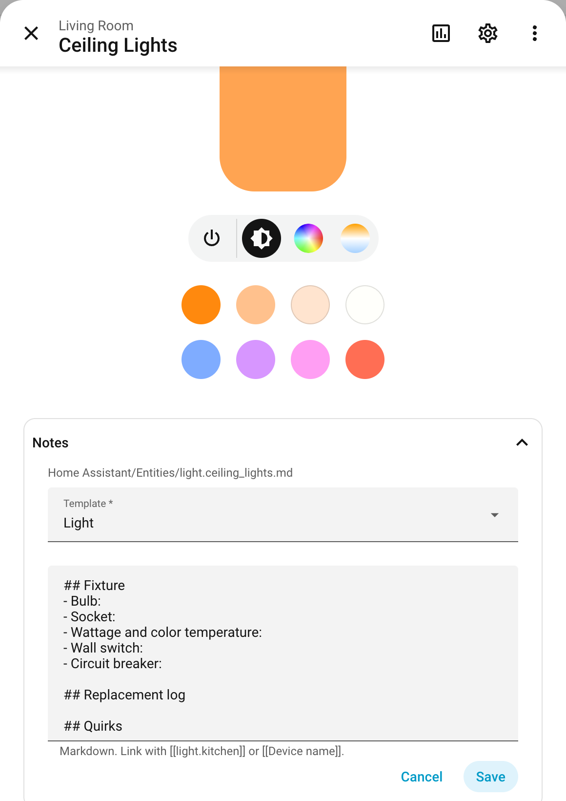

<p align="center">
  
</p>

<h1 align="center">Notes Vault for Home Assistant</h1>

<p align="center">
  A full notes app for your home, inside Home Assistant, with a note on every entity, device and area.<br>
  Built so your AI assistant writes down what it learns about your house, and reads it back next time.
</p>

<p align="center">
  <a href="https://my.home-assistant.io/redirect/hacs_repository/?owner=FezVrasta&repository=ha-notes-vault&category=integration">
    
  </a>
</p>

<p align="center">
  
  
  
  
  
  
</p>

---

Every home has facts that live nowhere: which breaker the boiler is on, when the smoke detector battery was replaced, why that automation waits 40 seconds. An AI assistant working on Home Assistant has it worse: it spends an hour working out why the heat pump ignores the thermostat, fixes it, and the next session starts from zero.

Notes Vault gives Home Assistant a notes vault, with a generated note for every entity, device, area and integration. You write in it from the Home Assistant UI, your assistant reads and writes it through Home Assistant actions, and because it's a plain Obsidian-format folder you can open it in Obsidian too.

- [What you get](#what-you-get)
- [Install](#install)
- [For your AI assistant](#for-your-ai-assistant)
- [The vault](#the-vault)
- [Templates](#templates)
- [Obsidian](#obsidian)
- [Options](#options)
- [Limitations](#limitations)

## What you get

<p align="center">
  
  <br><em>The Notes panel: every note in the vault, with the ones linking to it.</em>
</p>

<table>
  <tr>
    <td width="60%"></td>
    <td width="40%"></td>
  </tr>
  <tr>
    <td><em>A Notes card on every device and area page.</em></td>
    <td><em>A Notes section in every entity's more-info dialog.</em></td>
  </tr>
</table>

- **A Notes panel** in the sidebar: the whole vault as a tree, with search, backlinks, and folders you can create, rename, move and delete. Administrators only, since the vault can hold anything.
- **Notes where you need them:** in every entity's more-info dialog, on device and area pages, and in the automation, script and scene editors. Wikilinks open the entity, device, area or note they point at.
- **An editor like Obsidian's.** Markdown renders as you write it, and the syntax shows only on the line you're editing. Type `[[` to link a note, an entity, a device or an area. The panel saves as you type.
- **A generated note for everything**, linked to its device, area, integration and whatever it's built from, so Obsidian's graph and backlinks show how your home fits together.
- **Templates**, so a light's note asks for the bulb and the breaker and a battery device's for a replacement log.
- **Actions for AI and automations**, plus a skill that teaches assistants to use them.
- **WebDAV sync** with Obsidian and any other WebDAV client.
- **A dashboard card**, `custom:notes-vault-card`, for the note of one entity, device or area.

## Install

Click the badge above (or add this repository to HACS as a custom **Integration**), install, restart, then add **Notes Vault** from **Settings → Devices & services**.

Setup asks for one thing: the folder that holds the vault, relative to the config directory (default `notes_vault`). It's created if missing and included in backups. The first sync writes the generated notes once Home Assistant has started.

## For your AI assistant

Assistants that work on Home Assistant are good at reading the current state and bad at remembering anything else. The registries say a device exists; they don't say it's in the attic, that a firmware update bricked it once, or that you already tried lowering the flow temperature. The vault is where that goes.

They don't take notes unless they're told to, so the repository ships a skill that tells them when to read a note, what's worth writing down, and how to start from a template.

**Claude Code:**

```bash
claude plugin marketplace add FezVrasta/ha-notes-vault
claude plugin install ha-notes-vault@ha-notes-vault
```

**Claude.ai and Claude Desktop:** download [`ha-notes-vault-skill.zip`](https://github.com/FezVrasta/ha-notes-vault/releases/latest/download/ha-notes-vault-skill.zip) and upload it in **Settings → Capabilities → Skills**.

**Cursor, Codex, OpenCode, Gemini CLI and other agents that read skills:**

```bash
npx skills add FezVrasta/ha-notes-vault
```

The assistant needs a Home Assistant MCP server that can call actions with response data. These are the actions:

| Action | Does |
| --- | --- |
| `get_note` / `set_note` | Read, replace or append to the note of an entity, device or area |
| `search` | Find notes containing every word of a query |
| `get_template` / `list_templates` | The template that fits something, or all of them |
| `read_file` / `write_file` / `delete_file` / `list_files` | Any file in the vault |
| `sync` | Regenerate the notes now |

`get_note`, `get_template` and `list_templates` work for every user; the rest need an administrator. Every write fires a `notes_vault_updated` event, so you can automate on an assistant writing something.

For an assistant without skills, the gist of it fits in its instructions:

```markdown
Home Assistant has a notes vault, through the notes_vault actions.
- Before working on an entity, device or area, read its note with get_note.
- Before asking me something about the house, search the vault.
- When you learn something Home Assistant doesn't know, append it to the note
  with set_note and append: true.
```

## The vault

```
notes_vault/
├── Home Assistant/
│   ├── Areas/  Devices/  Entities/  Integrations/
│   ├── Automations/  Scripts/  Scenes/
│   ├── Templates/
│   └── Index.md
└── anything else you write
```

A generated note, trimmed:

```markdown
---
entity_id: light.kitchen_ceiling
name: Ceiling lamp
integration: hue
device: '[[Home Assistant/Devices/Ceiling lamp|Ceiling lamp]]'
area: '[[Home Assistant/Areas/Kitchen|Kitchen]]'
tags:
- Home-Assistant/Entity/Light
---
Bulb is an E27, 2700K. Replaced 2026-01-10.
```

- **The frontmatter is Home Assistant's, the body is yours.** Keys and tags you add are kept. A note is only rewritten when its metadata changes, which keeps sync conflicts rare.
- **Everything is linked.** Entities to their device and area, devices to their area and integration, automations, scripts and scenes to everything they touch (templates included), and helpers to what they're built from. A helper left on its own in the graph is one nothing uses.
- **Renames follow.** Renaming an entity ID renames its note and rewrites every link to it.
- **Removing something keeps what you wrote.** Its note stays, marked `ha_removed: true`. Only notes nobody wrote in are deleted.
- **`Index.md` lists every note with something written in it**, the quickest way to see what you or an assistant have written down. It's regenerated; don't edit it.
- **Everything outside `Home Assistant/` is yours** and never touched.
- **Nothing is lost by accident.** Deleted notes and folders go to `.trash/`, the same folder Obsidian uses, and stay there for 30 days. So does the old version of anything an assistant replaces. A save based on an outdated version (you had the note open while an assistant or Obsidian changed it) is refused instead of overwriting the newer change.

## Templates

Every generated note starts out holding the template that fits it, and counts as empty until you write in it. **Add note** in Home Assistant starts from the same template, with a dropdown to pick another or a blank note.

<p align="center">
  
</p>

| Template | For |
| --- | --- |
| Device, Entity, Area | The fallbacks: location, purchase and warranty, what it's for, breakers |
| Appliance | Climate, water heater, vacuum, fan, humidifier or mower devices: consumables |
| Battery device | Devices with a battery sensor: battery type and replacement log |
| Network device | UniFi, FRITZ!Box, Omada, OpenWrt and similar: IP, VLAN, firmware log |
| Light | Bulb, socket, wattage, wall switch, breaker |
| Sensor | Placement, calibration |
| Automation | Automations and scripts: why it exists, how it works, decisions |
| Scene | When it's used, what it sets |
| Lock and security | Where codes and keys are kept (never the codes) |

Templates are notes in `Home Assistant/Templates/`, so you edit them like any other. Your edits stick, a template you delete stays deleted, and editing one updates every note still holding the old version. [Writing your own](docs/templates.md) covers matching and placeholders.

## Obsidian

The vault is in the Obsidian format, so Obsidian works on it, and so does anything else that opens an Obsidian vault (Foam, Zettlr). Home Assistant serves it over WebDAV:

| Setting | Value |
| --- | --- |
| Address | `https://<your Home Assistant>/api/notes_vault/dav` |
| Username | anything |
| Password | a long-lived access token of an **administrator** |

In Obsidian, sync with [remotely-save](https://github.com/remotely-save/remotely-save): pick **WebDAV**, use the settings above, set **Auth type** to `basic`, **Depth header** to `only supports depth='1'`, and **Change the remote base directory** to `vault`. Start from an empty Obsidian vault the first time.

[Obsidian tips](docs/obsidian.md) covers showing names instead of entity IDs, a cleaner graph, Dataview queries and Obsidian-side MCP servers.

## Options

**Settings → Devices & services → Notes Vault → Configure.**

| Option | Default | |
| --- | --- | --- |
| Folder for generated notes | `Home Assistant` | Inside the vault |
| Generate entity / device / area / integration notes | on | |
| Include diagnostic / configuration entities | off | A large share of most installs |
| Include hidden / disabled | off | |
| Skip these domains | `geo_location` | Feeds create and drop these by the minute |
| Skip these integrations, labels, devices, entities | none | Skipping a device skips its entities |
| Serve the vault over WebDAV | on | |

Filters only stop *empty* notes from being generated. Anything you've written in keeps its file.

## Limitations

- **Agents only take notes if you ask them to.** Install the skill or put it in their instructions.
- **Two-way sync can conflict** if you edit a note in Obsidian while Home Assistant rewrites its frontmatter. Rare, since it only writes when metadata changes.
- **Deleting a generated note doesn't stick.** It comes back at the next sync. Exclude it in the options instead.
- **Notes carry metadata, not live state**, so files don't churn with every sensor update.
- **WebDAV needs an administrator token.** Use HTTPS from outside your network.
- **The UI is injected into the frontend.** Home Assistant has no extension point for the more-info dialog or device page, so a frontend update can move things. If it does, the notes stop showing there; the panel, card and actions keep working.

## License

MIT.
